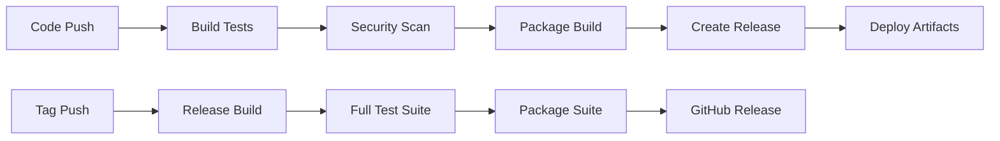

# LiteSuite

**Comprehensive suite of lightweight Windows administration tools for system management, process monitoring, and task automation.**

[](https://github.com/svtica/LiteSuite/releases/latest)
[](LICENSE)
[]()

LiteSuite is a collection of specialized utilities designed for Windows system administrators, IT professionals, and power users. Each tool focuses on a specific aspect of system management while maintaining a lightweight footprint and professional-grade capabilities.

## 📊 Project Status

| Tool | Status | Build | Release |
|------|--------|-------|---------|
| [LiteTask](https://github.com/svtica/LiteTask) | ✅ Production | [](https://github.com/svtica/LiteTask/releases/latest) |
| [LitePM](https://github.com/svtica/LitePM) | ✅ Production | [](https://github.com/svtica/LitePM/releases/latest) |
| [LiteDeploy](https://github.com/svtica/LiteDeploy) | 🚧 WIP | [](https://github.com/svtica/LiteDeploy/releases/latest) |
| [LiteRun](https://github.com/svtica/LiteRun) | 🚧 WIP | [](https://github.com/svtica/LiteRun/releases/latest) |
| [LiteSrv](https://github.com/svtica/LiteSrv) | 🚧 WIP | [](https://github.com/svtica/LiteSrv/releases/latest) |

## 🛠️ Tools Overview

### [LiteTask](https://github.com/svtica/LiteTask) 
**Advanced Task Scheduler Alternative**
- ✅ **Status**: Production Ready
- 🔧 **Tech**: VB.NET (.NET 8.0, Windows Forms)
- 📋 **Purpose**: Lightweight alternative to Windows Task Scheduler with PowerShell integration
- 🔗 **Repository**: [`github.com/svtica/LiteTask`](https://github.com/svtica/LiteTask)

**Key Features:**
- Advanced scheduling with multiple task types (PowerShell, Batch, SQL, Executables)
- Secure credential management and Windows service integration
- Built-in tool management and PowerShell module support
- Smart notifications and comprehensive logging

⚠️ **Note**: Can consume significant CPU during intensive operations - monitor resource usage.

---

### [LitePM](https://github.com/svtica/LitePM)
**Advanced Process Manager**
- ✅ **Status**: Production Ready  
- 🔧 **Tech**: VB.NET (.NET Framework 4.7.2, Windows Forms)
- 📋 **Purpose**: Comprehensive process monitoring and system management
- 🔗 **Repository**: [`github.com/svtica/LitePM`](https://github.com/svtica/LitePM)

**Key Features:**
- Real-time process monitoring with detailed system insights
- Service management and performance metrics
- Process control (terminate, suspend, priority management)
- Hardware information and network monitoring

⚠️ **Critical Issue**: Memory leak - restart periodically during extended sessions to prevent memory saturation.

---

### [LiteDeploy](https://github.com/svtica/LiteDeploy)
**Network Deployment Tool** 
- 🚧 **Status**: Work in Progress
- 🔧 **Tech**: C# (Windows Forms)
- 📋 **Purpose**: Remote Windows system management and file deployment
- 🔗 **Repository**: [`github.com/svtica/LiteDeploy`](https://github.com/svtica/LiteDeploy)

**Key Features:**
- Multi-computer remote management
- File deployment with integrity verification
- Remote command execution and PowerShell support
- Secure credential management

---

### [LiteRun](https://github.com/svtica/LiteRun)
**Remote Execution Utility**
- 🚧 **Status**: Work in Progress  
- 🔧 **Tech**: C++ (Native Windows)
- 📋 **Purpose**: Lightweight remote command execution
- 🔗 **Repository**: [`github.com/svtica/LiteRun`](https://github.com/svtica/LiteRun)

**Key Features:**
- Command execution on remote Windows systems
- Multiple authentication methods
- Real-time output capture and process control
- Minimal resource footprint

---

### [LiteSrv](https://github.com/svtica/LiteSrv)
**Windows Service Wrapper**
- 🚧 **Status**: Work in Progress
- 🔧 **Tech**: C++ with .NET interop
- 📋 **Purpose**: Convert applications into managed Windows services
- 🔗 **Repository**: [`github.com/svtica/LiteSrv`](https://github.com/svtica/LiteSrv)

**Key Features:**
- Application-to-service conversion
- XML-based configuration system
- Process monitoring and automatic restart
- Service lifecycle management

## 🎯 Use Cases

### System Administration
- **Daily Operations**: Use LitePM for process monitoring and LiteTask for automation
- **Remote Management**: Deploy updates with LiteDeploy and execute commands via LiteRun
- **Service Management**: Wrap legacy applications as services using LiteSrv

### IT Infrastructure
- **Monitoring**: Real-time system health monitoring across multiple servers
- **Automation**: Scheduled maintenance tasks with credential management
- **Deployment**: Centralized software deployment and configuration management

### Development & Testing
- **Environment Management**: Automate test environment setup and teardown
- **Process Monitoring**: Debug application behavior and resource usage
- **Service Testing**: Convert applications to services for testing scenarios

## 📦 Installation

### Individual Tools
Each tool can be downloaded and used independently:

1. Download the desired tool from its respective repository
2. Extract to your preferred location
3. Run the executable (some features may require administrative privileges)

### Complete Suite
For the full suite experience:

1. Clone or download all repositories
2. Extract each tool to a common directory structure:
   ```
   LiteSuite/
   ├── LiteTask/
   ├── LitePM/
   ├── LiteDeploy/
   ├── LiteRun/
   └── LiteSrv/
   ```
3. Add tools to your PATH environment variable for command-line access

## ⚙️ System Requirements

- **Operating System**: Windows 7 or later
- **Framework Requirements**:
  - .NET 8.0 Runtime (for LiteTask)
  - .NET Framework 4.7.2 (for LitePM)
  - .NET Framework 4.5+ (for LiteDeploy)
  - Visual C++ Redistributable (for LiteRun, LiteSrv)
- **Privileges**: Administrative rights recommended for full functionality
- **Network**: Required for remote management features

## 🔒 Security Considerations

- **Credential Management**: All tools support secure credential storage
- **Network Security**: Configure firewalls appropriately for remote operations
- **User Privileges**: Run with minimal required privileges following principle of least access
- **Audit Logging**: Comprehensive logging available for security auditing

## 📚 Documentation

Each tool includes comprehensive documentation:
- **README.md**: Feature overview and basic usage
- **help.md**: Detailed help files (where available)
- **Configuration Examples**: Sample configuration files and usage scenarios

## 🔨 Build & Release

### Automated Builds

Each tool repository includes GitHub Actions workflows for automated building and testing:

**LiteTask** (VB.NET/.NET 8.0):
```yaml
# .github/workflows/build.yml
- Build: dotnet build
- Test: dotnet test  
- Package: dotnet publish -c Release
- Artifacts: Windows x64 executable + dependencies
```

**LitePM** (VB.NET/.NET Framework 4.7.2):
```yaml
# .github/workflows/build.yml  
- Build: MSBuild with VS Build Tools
- Package: Application + dependencies
- Artifacts: Windows Forms executable
```

**LiteDeploy** (C#/Windows Forms):
```yaml
# .github/workflows/build.yml
- Build: MSBuild or dotnet build
- Package: Executable + config files
- Artifacts: Deployment-ready package
```

**LiteRun & LiteSrv** (C++):
```yaml
# .github/workflows/build.yml
- Build: Visual Studio 2022 or MSBuild
- Platform: x64, x86 (multi-platform)
- Artifacts: Native executables + libraries
```

### Release Process

#### Automated Releases
- **Trigger**: Git tags following semantic versioning (v1.0.0, v1.1.0, etc.)
- **Process**: 
  1. Automated build on tag push
  2. Run test suites (where available)
  3. Package binaries and dependencies
  4. Create GitHub release with changelog
  5. Upload artifacts as release assets

#### Manual Releases
For development releases or hotfixes:
```bash
# Tag and push for automated release
git tag v1.0.0
git push origin v1.0.0

# Or trigger manual workflow
gh workflow run release.yml
```

### Build Requirements

#### Development Environment
- **Visual Studio 2022** or **VS Build Tools 2022**
- **.NET 8.0 SDK** (for LiteTask)
- **.NET Framework 4.7.2 SDK** (for LitePM, LiteDeploy)
- **Windows 10/11 SDK** (for C++ projects)
- **PowerShell 7+** (for build scripts)

#### CI/CD Environment
```yaml
# Common GitHub Actions setup
runs-on: windows-latest
steps:
  - uses: actions/checkout@v4
  - uses: actions/setup-dotnet@v3
    with:
      dotnet-version: '8.0.x'
  - uses: microsoft/setup-msbuild@v1
```

### Package Distribution

#### Individual Tool Releases
- **GitHub Releases**: Primary distribution method
- **Artifacts**: 
  - Portable executables (no installer required)
  - Configuration templates
  - Documentation (README, help files)
  - License files

#### Suite Releases
- **LiteSuite Releases**: Consolidated package with all tools
- **Versioning**: Independent tool versions + suite version
- **Structure**:
  ```
  LiteSuite-v2.0.0.zip
  ├── LiteTask/          (v1.0.1)
  ├── LitePM/            (v1.2.0)  
  ├── LiteDeploy/        (v0.9.0)
  ├── LiteRun/           (v0.8.0)
  ├── LiteSrv/           (v0.7.0)
  ├── README.md
  └── INSTALL.md
  ```

### Quality Assurance

#### Automated Testing
- **Unit Tests**: Where applicable (primarily .NET projects)
- **Integration Tests**: Basic functionality verification
- **Security Scanning**: CodeQL and dependency scanning
- **Performance Tests**: Basic resource usage validation

#### Manual Testing
- **Compatibility Testing**: Windows 10/11, different .NET versions
- **Security Testing**: Credential management, privilege handling
- **Functionality Testing**: Core features validation before release

### Deployment Pipeline



## 🐛 Known Issues & Limitations

### Critical Issues
- **LitePM**: Memory leak during extended use - restart periodically
- **LiteTask**: High CPU usage during intensive task execution

### Development Status
- **Production Ready**: LiteTask, LitePM
- **Work in Progress**: LiteDeploy, LiteRun, LiteSrv

## 🤝 Contributing

These projects are **not actively developed** but **moderate contributions are accepted** for:
- Bug fixes and stability improvements
- Documentation enhancements
- Minor feature additions
- Security improvements

### Contribution Guidelines
1. Fork the specific tool repository
2. Create a feature branch
3. Submit a pull request with clear description
4. Ensure compatibility with existing functionality
5. Verify builds pass all CI checks

## 📄 License

All tools in the LiteSuite are released under [The Unlicense](LICENSE) - public domain.

You are free to use, modify, and distribute these tools without any restrictions.

## 🏗️ Architecture

LiteSuite follows a modular architecture where each tool:
- **Operates Independently**: No dependencies between tools
- **Shares Common Principles**: Lightweight design, security-first approach
- **Maintains Consistency**: Similar UI patterns and configuration methods
- **Focuses on Specific Tasks**: Each tool excels in its domain

## 📞 Support

- **Documentation**: Refer to individual tool README files
- **Issues**: Report problems in the specific tool's repository
- **Community**: Share experiences and solutions with other users

---

**LiteSuite** - Professional Windows administration tools for modern IT environments.

*Developed for system administrators who need reliable, lightweight tools that get the job done.*
